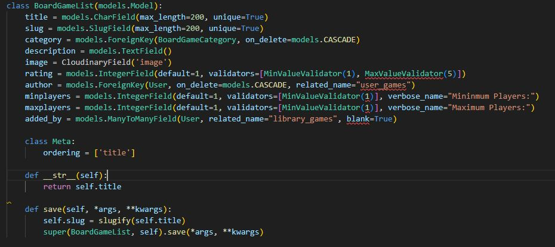
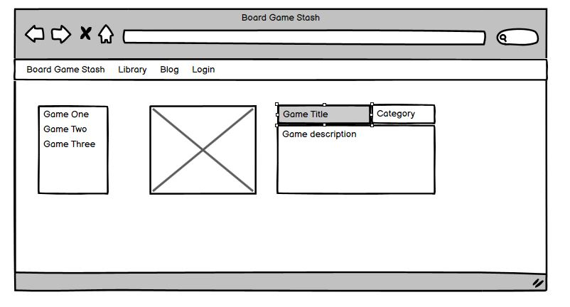
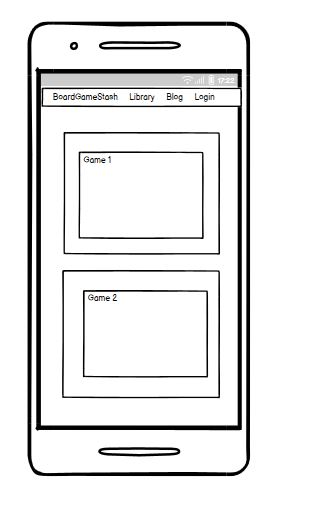
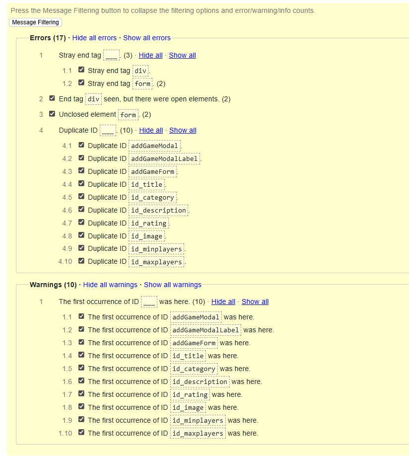

# board-game-stash

Welcome to the README for Board Game Stash, a website that lets you catalog your board game collection and sort through it to see what you have available to play.

Visit the deployed site: 

Utilising the Django framework with Python made for an interesting project, and I wanted to build something that I would personally find useful that I knew would be able to link databases together,
to try and bolster my knowledge and understanding of how to get the most use out of Django to hopefully take forward into future projects.

## Table of Contents

1. [Rationale](#rationale)
2. [User Stories](#user-stories)
3. [Initial Planning](#initial-planning)
    - [ERD Diagram](#erd-diagram)
    - [Desktop Wireframes](#desktop-wireframes)
    - [Mobile Wireframes](#mobile-wireframes)
4. [Testing](#testing)
    - [Code Validation](#code-validation)
    - [Bugs Found](#bugs-found)
    - [Django Tests](#django-tests)
5. [Deployment](#deployment)
6. [References](#references)

### Rationale

Building Board Game Stash, I wanted to create a site that I felt I could make use of. I already have the collection of games so wanted to be able to sort through them in a way that made sense, and would let me break down the collection. I naturally then felt that adding functionality to let other users be able to create accounts and their libraries would help build on knowledge of having different databases to interact with each other and create a usable site. 

The long term aim for the site would be similar to sites that exist currently for different formats, whereby users can upload their library and then look at similar libraries and find games that are similar to games the user owns to help them find new games to play. 

For each added game by users, this would then build up the library in the background for users to then be able to auto populate all the fields that they need to supply when adding games to their personal library, which would allow the information stored within the website to grow organically and then be available to future users. 

### User Stories

- 'I have a collection of board games and would like to see an itemised list of the games in my collection, therefore I want to upload my library to a database and sort through it via different parameters'.

- 'I have some board games already and would like to see other people's libraries to try and find new games to play'.

### Initial planning

#### ERD Diagram

For the databases, I knew from the get go I would only need a few, keeping the users in one database and then having a library database which linked to each user was then essential. In creating the database diagram, I also thought that it would be beneficial from a UX perspective, to try and standardise the 'Category' element of each game, as there may only be one card game called 'Uno', however Uno will not be the only 'Card Game'. So having the categories stored in a different database, would mean that I can preload categories into the database ahead of time, allowing the user to then select the one that they want. 

This diagram helped me create the basis for the main model of the library.

Adding the model and beginning work on the site was really a case of adapting what I had initially conceived as I went on. So initially as seen above, I kept to basically the inital list I had decided on in my diagram, with the addition of the slug line which I would use later to help build individual game pages within the HTML. 

For UX purposes I then wanted to add a few extra fields to the model, to give users more options of how to list their games. When thinking of games to play, I tend to think of how many players I need to cater for, so adding a player count seemed needed. I thought about adding one field and allowing users to add a string for the player range, but using integers seemed like a better way to ensure form validation and consistency.

#### Wireframes

##### Desktop Wireframes

The main page in the wireframe stage showcased the images for the board games, and you could select each game from your library and see a detailed view.

It also references in the navbar a blog page, which I debated adding however I felt it strayed away from what I ultimately wanted the project to be, which was a way to store your library of games.

What I ended up doing, for ease and to stretch my learning of the Django framework, is seperating the side list of library games and the detailed view of the games into two pages. So the user can see their library, and then also click on an individual game and be led to a detailed view page. 

#### Phone Wireframes

The phone library page would simply just list the games sequentially as cards in a list.

### Testing

#### Code Validation

The HTML came with some warnings and errors, however I believe they may have been picked up mainly from working around the Django Template Language, as some of the warnings seemed like it misreading the code. An example being the form tag not closing, possible due to it being on the outside of a the modal-body div.

The JSLint page came up with some warnings for the script, however they were mainly semantic and the site has no issues with the script loading.

#### Bugs Found

This was quite a simple bug that I picked up early on, where the HTML page wasn't linking to the base.html page, and it was a simple fix, just putting the apostrophes around the link fixed that.

One bug that i've encountered that I have been unable to fix is that uploading an image to the site from the user page doesn't seem to save it to the database and display it, however uploading it from the actual site appears to not load the image.

#### Django Tests

