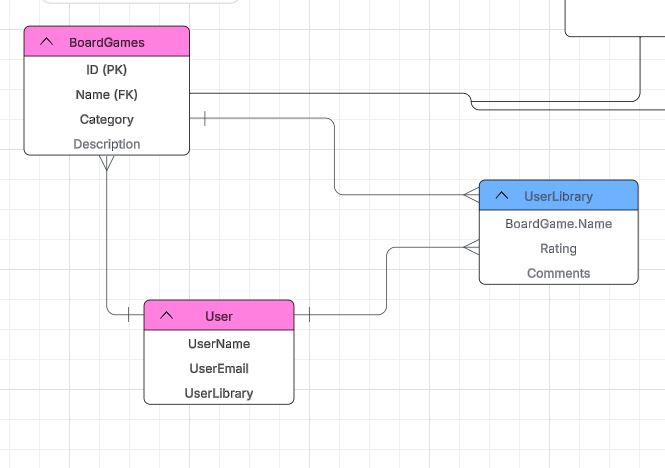
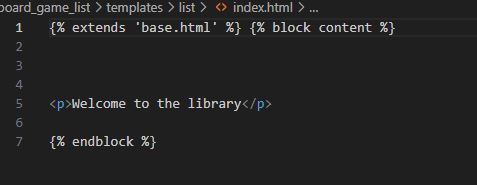

# board-game-stash

Welcome to the README for Board Game Stash, a website that lets you catalog your board game collection and sort through it to see what you have available to play.

Visit the deployed site: 

Utilising the Django framework with Python made for an interesting project, and I wanted to build something that I would personally find useful that I knew would be able to link databases together,
to try and bolster my knowledge and understanding of how to get the most use out of Django to hopefully take forward into future projects.

## Table of Contents

1. [Rationale](#rationale)
2. [User Stories](#user-stories)
3. [Initial Planning](#initial-planning)
    - [ERD Diagram](#erd-diagram)
    - [Desktop Wireframes](#desktop-wireframes)
    - [Mobile Wireframes](#mobile-wireframes)
4. [Styling](#Styling)
5. [Testing](#testing)
    - [Code Validation](#code-validation)
    - [Bugs Found](#bugs-found)
    - [Django Tests](#django-tests)
6. [Deployment](#deployment)
7. [References](#references)

### Rationale

Building Board Game Stash, I wanted to create a site that I felt I could make use of. I already have the collection of games so wanted to be able to sort through them in a way that made sense, and would let me break down the collection. I naturally then felt that adding functionality to let other users be able to create accounts and their libraries would help build on knowledge of having different databases to interact with each other and create a usable site. 

The long term aim for the site would be similar to sites that exist currently for different formats, whereby users can upload their library and then look at similar libraries and find games that are similar to games the user owns to help them find new games to play. 

For each added game by users, this would then build up the library in the background for users to then be able to auto populate all the fields that they need to supply when adding games to their personal library, which would allow the information stored within the website to grow organically and then be available to future users. 

### User Stories

- 'I have a collection of board games and would like to see an itemised list of the games in my collection, therefore I want to upload my library to a database and sort through it via different parameters'.

- 'I have some board games already and would like to see other people's libraries to try and find new games to play'.

### Initial planning

#### ERD Diagram

For the databases, I knew from the get go I would only need a few, keeping the users in one database and then having a library database which linked to each user was then essential. In creating the database diagram, I also thought that it would be beneficial from a UX perspective, to try and standardise the 'Category' element of each game, as there may only be one card game called 'Uno', however Uno will not be the only 'Card Game'. So having the categories stored in a different database, would mean that I can preload categories into the database ahead of time, allowing the user to then select the one that they want. 

### Testing

#### Bugs Found

